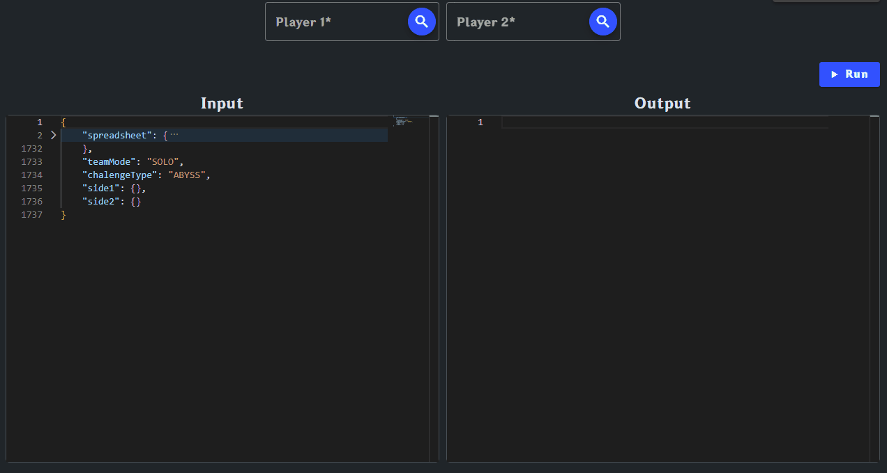
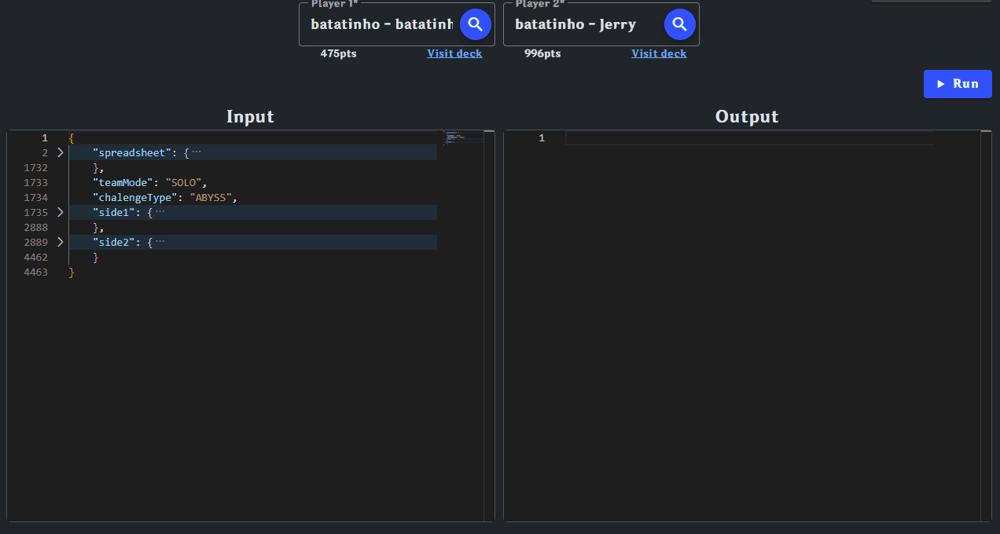
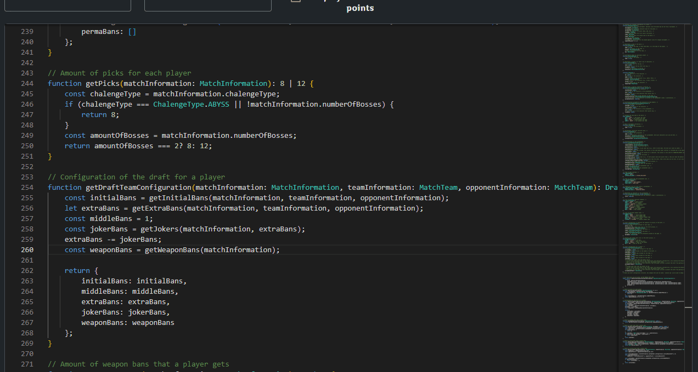
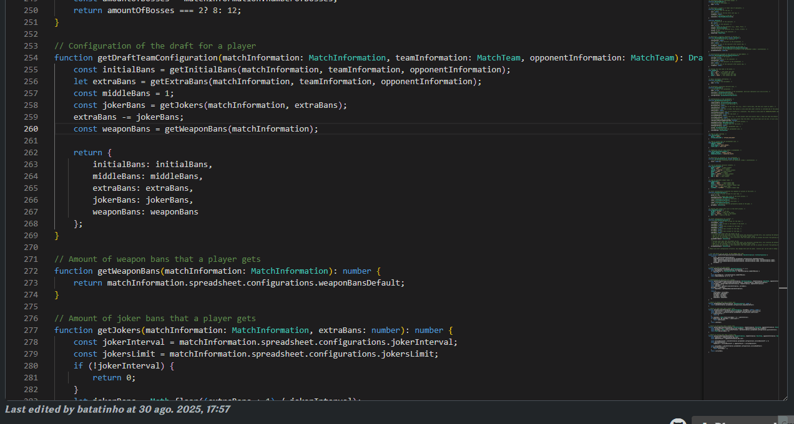

# Gentor Custom Scripts

This repository contains the documentation and resources for creating **custom scripts** used on [Gentor](https://gentor.com) to configure competitive matches.

---

## 📖 Background

The original game does not support native PvP. However, the community created a competitive format using **balancing spreadsheets**.  
These spreadsheets define how many points each character costs and how to calculate disadvantages between players.

Gentor automates this process, but since rules often change, we provide a way to **customize the balancing logic via TypeScript scripts**.

---

## ⚙️ How it works

- The **spreadsheet owner** can write a **TypeScript script**.  
- The script receives all **match data** as input (players, characters, costs, etc.).  
- The script must return the **match configuration**, for example:
  - How many characters each player must ban.

---

## 📂 Resources

To help you get started, we provide additional files in this repository:

- **[Default Script](examples/default-script.ts)** → A boilerplate script with the required structure.  
- **[Type Definitions](types/match-information.d.ts)** → All available interfaces and objects documented in TypeScript.  
- **[Example Scripts](examples/)** → Ready-to-use scripts showing common use cases.  

---

## ⚠️ Important

Every script must contain the line:

```ts
// All code below will be saved
```

This line is required by Gentor’s script engine to identify where the code actually starts. In case this line is removed, the script will not be saved.
**Do not remove or modify it.**

---

## 🏛️ Basic Structure
Basic structure of the input and output data. For more info, access [the type file](types/match-information.d.ts).

### ⬇️ Input Structure: `MatchInformation`

    MatchInformation
    ├── tournament? : Tournament
    ├── spreadsheet : Spreadsheet
    │   ├── characters : SpreadsheetCharacter[]
    │   └── configurations : SpreadsheetConfigurations
    ├── teamMode : TeamMode
    ├── side1 : MatchTeam
    │   ├── name : string
    │   ├── players : MatchTeamPlayer[]
    │   └── box : MatchTeamBox
    │       └── characters : MatchTeamBoxCharacter[]
    ├── side2 : MatchTeam (same structure as side1)
    ├── chalengeType : ChalengeType
    └── numberOfBosses? : 2 | 3

### ⬆️ Output Structure: `DraftConfiguration`

    DraftConfiguration
    ├── picks : 8 | 12
    ├── weaponBanLocation : WeaponBanLocation
    ├── side1 : DraftTeamConfiguration
    │   ├── initialBans : number
    │   ├── middleBans : number
    │   ├── weaponBans : number
    │   ├── extraBans : number
    │   ├── jokerBans : number
    │   ├── allowedExtraBans? : Character[]
    │   └── allowedJokerBans? : Character[]
    ├── side2 : DraftTeamConfiguration (same structure as side1)
    └── permaBans : Character[]


---

## 🧪 Testing your script

You can test your script locally in your own machine or use Gentor's integrated Playground.

Gentor provides an integrated **Playground** where you can test your script before using it in real matches:

- You can **select players** to automatically generate match inputs.

- The **input JSON** can also be edited manually.  

- You can use `console.log` inside your script → Gentor provides a **safe console** to capture and display your logs.

- Errors will also appear in the integrated console.


This makes it easy to debug and validate your logic without leaving the site.

_The integrated playground may or may not undergo changes, differing from the images shown._

---

## ✅ Best practices

- Avoid infinite loops (`while(true)`).  
- Use only the provided API (no access to `window`, `document`, or network requests).  
- Test your script with different scenarios in the Playground before using it in real matches.  

---

## 🔒 Security

- Scripts run in an isolated sandbox environment.  
- No access to external resources, filesystem, or the internet.  
- Execution time is limited to prevent freezing.  

---

## 📌 Contributions

If you want to suggest improvements to the API or documentation, feel free to open an **issue** or **pull request** in this repository.
